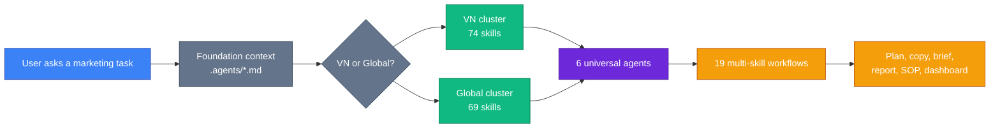
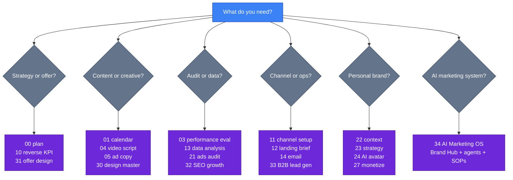

<p align="center">
  <a href="README.md"></a>
  <a href="README.vi.md"></a>
</p>

<p align="center">
  
  
  
  
  
  
  <a href="https://www.opa.business/donate"></a>
</p>

<h1 align="center">ai-business-skills</h1>

<p align="center">
  <strong>Fullstack marketing skills cho AI agent — 143 skills bilingual (VN + Global).</strong>
  <br/>
  <sub>Vietnamese-first + Global (US/EU/SEA/LATAM) | Over Powers Agency</sub>
</p>

<p align="center">
  <a href="https://github.com/minhnv0807/ai-business-skills/stargazers"></a>
  <a href="https://github.com/minhnv0807/ai-business-skills/network/members"></a>
  <a href="https://github.com/minhnv0807/ai-business-skills/issues"></a>
  <a href="https://github.com/minhnv0807/ai-business-skills/pulls"></a>
  <a href="https://github.com/minhnv0807/ai-business-skills/commits/master"></a>
</p>

> **v3.6.0** — Bilingual Role SOP: 33 skill Global mirror hoàn tất parity cho 4 vai trò. Cộng v3.5.0 (33 skill VN + kho `knowledge/` + agent `design-producer` + 4 workflow vòng lặp). Zero breaking changes. [Changelog](CHANGELOG.md)

---

## 🧭 System map — read this first

ai-business-skills turns one marketing request into a routed workflow: context first, then the right skill cluster, then an agent/workflow when the job spans multiple steps.



| Layer | What it gives you | Start here |
|-------|-------------------|------------|
| Context | Product, audience, positioning, proof, objections | `product-marketing-context` |
| Skills | Single jobs like plan, copy, SEO, report, offer, SOP | `skills/vi/` or `skills/en/` |
| Agents | Role-based routing for strategy, content, design, performance, channels, personal brand | `agents/` |
| Workflows | Multi-step campaigns and recurring operating loops | `workflows/` |
| Knowledge | Foundation thinking to upload into role-based AI projects | `knowledge/` |
| OS | Brand Hub, second brain, data loop, governance | `34-ai-marketing-os` |

### Pick the right entry point



## ⚡ Quick start (30 giây)

```bash
git clone https://github.com/minhnv0807/ai-business-skills.git
cd ai-business-skills
bash install.sh --global   # 143 skills -> ~/.claude/skills/marketing/
```

Windows:

```powershell
.\install.ps1 -Global
```

Test ngay trong Claude Code:

> "Lập kế hoạch marketing cho khóa AI Kiếm Tiền — target 100 học viên đầu tiên trong 30 ngày"

→ Skill `00-ke-hoach-mkt` tự kích hoạt, output file `.md` chi tiết với benchmark VN 2025-2026, KPI 3 kịch bản, budget allocation, weekly timeline, risk matrix.

---

## 🎯 Khi nào dùng ai-business-skills?

✅ **Lập kế hoạch marketing toàn diện** — B2B SME VN / Global SMB / agency
✅ **Brief campaign** — TVC, performance ads, content calendar 30 ngày
✅ **Viết copy** — Facebook/TikTok ads, script video, email marketing, landing page brief
✅ **Personal brand strategy + AI avatar production** — founder/coach/creator
✅ **Phân tích đối thủ + insight khách hàng + audit ads** — diagnostic + 48h action plan
✅ **Design master** — 8 loại thiết kế (logo, key visual, social post, infographic...) qua prompt-driven workflow
✅ **Dropshipping mastery** (Global) — niche → product → store → ads → fulfillment → scale
✅ **Offer + SEO + B2B growth** — offer design, AI SEO/GEO, prospecting, cold outreach, sales handoff
✅ **AI Marketing OS** — Brand Hub, role-based agents/projects, skill chains, second brain, data loops, SOPs

❌ **Build product code** — repo này tập trung vào marketing/business skills
❌ **Write technical PRD/specs** — dùng tool tài liệu kỹ thuật riêng nếu cần
❌ **Deploy production infrastructure** — dùng workflow DevOps riêng nếu cần

---

## 📦 143 Skills (bilingual VN + Global)

> Mỗi skill = 1 file `SKILL.md` với frontmatter triggers + workflow body. AI agent tự kích hoạt skill khi user nhắc trigger keyword.

### Cluster 1: Marketing Core (22 numbered + foundation per cluster)

Foundation skill (`product-marketing-context` / `product-marketing-context-global`) đọc **1 lần** mỗi project → tránh hỏi lại sản phẩm/audience suốt session. Saves ~70% time.

| # | Skill (VN) | Global mirror | Use case |
|---|-----------|---------------|----------|
| ★ | product-marketing-context | product-marketing-context-global | Foundation — đọc trước mọi skill |
| 00 | 00-ke-hoach-mkt | 00-marketing-plan-global | Fullstack 7-section plan + SAVE framework |
| 01 | 01-lich-noi-dung | 01-content-calendar-global | Monthly calendar + 1:9 repurposing matrix |
| 02 | 02-brief-chien-dich | 02-campaign-brief-global | 9-section brief + RACI + risk mitigation |
| 03 | 03-danh-gia-hieu-suat | 03-performance-eval-global | Diagnostic tree + 5 Whys + 48h action |
| 04 | 04-script-video | 04-script-video-global | A/B scripts + 5 hooks + viral score |
| 05 | 05-copy-quang-cao | 05-ad-copy-global | 6 variations × 3 funnel tiers |
| 06 | 06-brief-ugc-egc | 06-ugc-egc-brief-global | Creator brief + legal + payment |
| 07 | 07-bao-cao-marketing | 07-marketing-report-global | 5-min readable monthly report |
| 08 | 08-nghien-cuu-doi-thu | 08-competitor-research-global | 3-tier competitor + SWOT + positioning map |
| 09 | 09-insight-khach-hang | 09-customer-insight-global | Persona + JTBD + customer journey |
| 10 | 10-tinh-kpi-nguoc | 10-reverse-kpi-global | Revenue → budget + 3 scenarios |
| 11 | 11-thiet-lap-kenh | 11-channel-setup-global | Setup 7 channels + 30-day plan |
| 12 | 12-brief-landing-page | 12-landing-page-brief-global | 7-section brief + A/B plan |
| 13 | 13-phan-tich-du-lieu | 13-data-analysis-global | Meta/TikTok/GA4 → insights + anomaly |
| 14 | 14-email-marketing | 14-email-marketing-global | Welcome/nurture/re-engage + automation |
| 15 | 15-social-listening | 15-social-listening-global | Brand monitoring + crisis protocol |
| 16 | 16-marketing-psychology | 16-marketing-psychology-global | 7 Cialdini principles + cultural adapt |
| 17 | 17-pricing-strategy | 17-pricing-strategy-global | Tiers + charm/anchor/bundle + break-even |
| 18 | 18-referral-program | 18-referral-program-global | 1-way/2-way/affiliate + anti-fraud |
| 19 | 19-ab-test-setup | 19-ab-test-setup-global | Sample size + 8 test types + significance |
| 20 | 20-brief-client-intake | 20-client-intake-brief-global | 20-industry intake (agency use) |
| 21 | 21-audit-ads-performance | 21-ads-audit-global | 84 checkpoints + Health Score 0-100 |

### Cluster 2: Personal Branding (7 VN + 7 Global)

For founder / coach / creator building personal brand with AI avatar.

| # | Skill (VN) | Global mirror | Use case |
|---|-----------|---------------|----------|
| 22 | 22-personal-brand-context ⭐ | 22-personal-brand-context-global | Foundation PB (3 variants: founder/coach/creator) |
| 23 | 23-personal-brand-strategy | 23-personal-brand-strategy-global | 12-month strategy + niche + authority ladder |
| 24 | 24-ai-avatar-production 🎬 | 24-ai-avatar-production-global | AI Avatar 3-tier tools + 4 workflows + QA Score |
| 25 | 25-voice-clone-podcast 🎙️ | 25-voice-clone-podcast-global | Voice clone, podcast, audiobook, 1:10 repurpose |
| 26 | 26-thought-leadership-content | 26-thought-leadership-content-global | Long-form: 3 structures, 6 hooks, 1:5 repurpose |
| 27 | 27-personal-brand-monetize | 27-personal-brand-monetize-global | 3 funnels + pricing psych + VN tax 2026 |
| 28 | 28-community-building | 28-community-building-global | Zalo/Telegram/Skool blueprint + 3-layer model |

### Cluster 3: Regional flagship (skill 29 — diverges per region)

| # | VN | Global |
|---|----|--------|
| 29 | `29-xuat-khau-b2b` — Export B2B playbook cho SME Việt | `29-dropshipping-mastery-global` 🚀 — Shopify + supplier + winning products + global ads + fulfillment SOP + scale to $10K/mo+ |

### Cluster 4: Design Master (1 VN + 1 Global) ⭐ NEW v2.7.0

| # | Skill | Coverage |
|---|-------|----------|
| 30 | `30-thiet-ke-master` (VN) / `30-design-master-global` (EN) | 8 design types: personal-brand · business-logo · business-campaign · marketing-day-to-day · editorial · infographic · web-mockup (hybrid) · quote-graphic. Auto-reads brand identity → composes prompt → generates via `gpt-image-2` API OR outputs paste-ready prompts cho 5 platforms (DALL-E 3, MidJourney, Leonardo, Imagen, Bing). |

### Cluster 5: Growth + AI Marketing OS (4 VN + 4 Global) ⭐ NEW v3.4.0

| # | Skill | Coverage |
|---|-------|----------|
| 31 | `31-offer-design` / `31-offer-design-global` | Package the thing being sold: value stack, guarantee, bonus, scarcity, upsell/downsell, and offer ladder. |
| 32 | `32-seo-growth` / `32-seo-growth-global` | SEO audit, AI SEO/GEO, schema, programmatic SEO, directory submissions, and backlink plan. |
| 33 | `33-b2b-lead-gen` / `33-b2b-lead-gen-global` | Prospecting, cold outreach, lead scoring, sales enablement, CRM handoff, and RevOps basics. |
| 34 | `34-ai-marketing-os` / `34-ai-marketing-os-global` | Brand Hub/source of truth, role-based AI agents/projects, skill chains, second brain, data loops, SOPs, and governance. |

### Cluster 6: Role SOP packs (33 VN skills) ⭐ NEW v3.5.0

Bốn bộ SOP theo vai trò — mỗi bộ là quy trình vận hành đầy đủ với decision rules, tiêu chuẩn chất lượng, và timeline, không chỉ là prompt đơn lẻ.

| Pack | Skills | Coverage |
|------|--------|----------|
| **Content system (35-40)** | `35-brand-voice` · `36-content-brief` · `37-caption-social` · `38-seeding-plan` · `39-content-audit` · `40-next-content-plan` | Brand voice document (nền tảng cho mọi output content) → brief từng bài → caption organic → seeding cộng đồng → audit cuối tháng → plan kỳ sau từ data |
| **Design production (41-50)** | `41-campaign-asset-list` · `42-brief-hinh-anh` · `43-brief-carousel` · `44-brief-video-editor` · `45-brief-canva` · `46-brand-guideline` · `47-design-review` · `48-quick-visual-brief` · `49-html-email-template` · `50-asset-resize` | Asset list theo campaign → brief từng loại visual → brand guideline → review chấm điểm → asset gấp khi đang chạy → HTML email → resize winner |
| **Performance ops (51-57)** | `51-audience-research` · `52-account-structure` · `53-tracking-setup` · `54-media-plan` · `55-scaling-ads` · `56-retargeting-plan` · `57-next-ads-plan` | Audience → media plan tính ngược từ doanh thu → tracking verify trước khi chạy → naming convention → scale winner → retarget theo tầng → plan kỳ sau |
| **Leader ops (58-67)** | `58-positioning` · `59-go-to-market` · `60-launch-playbook` · `61-budget-planning` · `62-marketing-review` · `63-campaign-retrospective` · `64-team-brief` · `65-team-performance-review` · `66-crisis-playbook` · `67-agency-vendor-brief` | Positioning + GTM + launch → phân bổ ngân sách → gate duyệt output → retro → giao việc + đánh giá team → xử lý khủng hoảng → quản lý agency |

**Bilingual:** cả 4 pack đều có bản Global (`skills/en/35-67 *-global`) từ v3.6.0 — cùng framework và quy trình, nhưng USD benchmark, kênh toàn cầu (Klaviyo/Shopify/Meta US), và compliance FTC/GDPR/CCPA. Community seeding được viết lại theo chuẩn Reddit/Discord/Slack thay vì Facebook Group VN.

**Kho kiến thức nền tảng:** [`knowledge/`](knowledge/) — 10 file tư duy (brandformance, blueprint 8 thành phần, phễu 6 bước, chiến lược kênh, Meta Ads framework, hệ thống KPI, customer insight, brand/offer architecture, AI Marketing OS, business model) + `knowledge/trien-khai/`. Dùng làm context upload cho AI project theo vai trò.

### 6 Marketing Agents (Universal mode — VN + Global auto-detect)

> Agents auto-detect cluster (VN vs Global) via `.agents/` context file. No manual config.

| Agent | Vai trò | Skills chính |
|-------|---------|--------------|
| [mkt-strategist](agents/mkt-strategist.md) | Chiến lược tổng + Leader strategy | 00, 02, 08, 09, 16, 17, 31-34, 58-61 (+ `-global` mirrors) |
| [content-producer](agents/content-producer.md) | Sản xuất nội dung + content system | 01, 04, 05, 06, 35-40, 42-44 (+ `-global`) |
| [performance-analyst](agents/performance-analyst.md) | Phân tích hiệu suất + performance ops | 03, 07, 10, 13, 19, 21, 32, 34, 51-57 (+ `-global`) |
| [channel-operator](agents/channel-operator.md) | Vận hành kênh + crisis | 11, 12, 14, 15, 18, 34, 49, 66 (+ `-global`) |
| [design-producer](agents/design-producer.md) ⭐ | Visual & production | 12, 30, 41-50 |
| [personal-brand-builder](agents/personal-brand-builder.md) | PB + AI Avatar | 22-28 (+ `-global`) |

### 19 Workflows (multi-skill chains — 11 VN + 8 Global)

**VN workflows (11):**
- `campaign-launch` (14-21 ngày) — 08 → 09 → 00 → 02 → 01+04+05 → 06 → 11
- `client-onboard` (5-7 ngày, agency) — 20 → 09 → 08 → 10 → 00 → 02 → 01
- `monthly-cycle` (3-5 ngày) — 13 → 03 → 07 → 10 → 01
- `content-production` (weekly) — review calendar → 04 → film → 05 → schedule
- `content-engine` ⭐ (vòng lặp tháng) — 35 → 09 → 01 → 36 → [37|04|05|38] → [42|43|44] → 39 → 07 → 40
- `performance-loop` ⭐ (vòng lặp ads) — 51 → 10 → 54 → 53 → 52 → 19 → 21 → 55/56 → 07 → 57
- `design-pipeline` ⭐ (T-14 → D+1) — 41 → [42|43|45] → 47 → 50
- `leader-cadence` ⭐ (quý/campaign/tuần) — 00 → 61 → 02 → 64 → 62/47 → 07 → 63
- `personal-brand-launch` (30 ngày) — 22 → 23 → 24 → 26 → 27 → 28
- `ai-avatar-batch` (5 ngày × 5h) — 30 AI Avatar videos, <$2/video
- `personal-brand-monthly` (3-5 ngày) — 13 → 03 → 07 → review pillars

**Global workflows (8):** mirrors above + `dropshipping-launch-global` (14-30 ngày): niche → product validation → store → ads → fulfillment → scale.

---

## 🌐 Cài đặt theo nền tảng AI

Skills là **markdown files với frontmatter** — bất kỳ AI agent nào đọc được `.md` đều dùng được. Dưới đây là setup cho từng platform cụ thể.

### Tier 1 — Native skill support (recommended)

#### 1. Claude Code

Cài qua install script:

```bash
git clone https://github.com/minhnv0807/ai-business-skills.git
cd ai-business-skills

bash install.sh --global    # → ~/.claude/skills/marketing/
# hoặc
bash install.sh --project   # → .claude/skills/marketing/ trong project hiện tại
```

Windows PowerShell:

```powershell
.\install.ps1 -Global
```

Hoặc cài qua Claude Code plugin marketplace:

```
/plugin marketplace add minhnv0807/ai-business-skills
/plugin install ai-business-skills
```

**Use ngay sau cài:**

```
> Set up product marketing context cho Luna Spa
> Lập kế hoạch marketing cho tháng 5
> CPMess 45K, ROAS 1.8x — audit và đề xuất tối ưu
```

#### 2. OpenCode + Ollama Pro Cloud

OpenCode hỗ trợ load skill markdown qua config. Pair với Ollama Cloud Pro (local + cloud routing) cho cost-efficient.

**Setup:**

```bash
# Cài skills vào ~/.claude/skills/marketing/ trước (dùng bash install.sh --global)
# Sau đó reference từ OpenCode config:
```

Sample `~/.opencode/config.json`:

```json
{
  "skills": {
    "root": "~/.claude/skills/marketing",
    "auto_load": ["product-marketing-context", "00-ke-hoach-mkt", "30-thiet-ke-master"]
  },
  "providers": {
    "ollama_cloud": {
      "base_url": "https://ollama.com/api",
      "api_key": "${OLLAMA_API_KEY}"
    }
  },
  "routing": {
    "strategy": ["00-ke-hoach-mkt", "23-personal-brand-strategy", "mkt-strategist"],
    "strategy_model": "qwen2.5:72b",
    "copy":     ["05-copy-quang-cao", "04-script-video", "14-email-marketing"],
    "copy_model": "llama-3.3:70b",
    "analytics": ["03-danh-gia-hieu-suat", "13-phan-tich-du-lieu", "21-audit-ads-performance"],
    "analytics_model": "deepseek-r1"
  }
}
```

**Model backend mapping (recommended):**

| Skill type | Model | Lý do |
|-----------|-------|-------|
| Strategic (00, 23, mkt-strategist) | `qwen2.5:72b` | Long-context reasoning + planning |
| Copy generation (04, 05, 14, 26) | `llama-3.3:70b` | Creative writing, instruction-following |
| Analytics (03, 13, 21) | `deepseek-r1` | Structured analysis + diagnostic chains |
| Design (30) | `qwen2.5:72b` | Prompt composition + brand voice |

**Cost note:** Ollama Cloud Pro ~$20/mo cho heavy use vs OpenAI/Anthropic API per-token (~$50-200/mo cho cùng workload).

#### 3. OpenAI Codex CLI

Reference skill markdown qua `--system-prompt-file` hoặc copy vào `~/.codex/skills/`:

```bash
# Cài skills vào ~/.claude/skills/marketing/ trước
codex --system-prompt-file ~/.claude/skills/marketing/00-ke-hoach-mkt/SKILL.md \
      "Lập kế hoạch marketing cho khóa AI Kiếm Tiền"
```

Skill `SKILL.md` works as system prompt fragment — frontmatter và body đều được Codex parse.

---

### Tier 2 — VS Code + AI extensions

#### 4. VS Code + Cline (recommended cho VS Code users)

Tạo `.clinerules` ở project root:

```markdown
# Cline rules — load ai-business-skills

When user mentions marketing tasks, load skills from:
- ~/.claude/skills/marketing/skills/vi/   (VN)
- ~/.claude/skills/marketing/skills/en/   (Global)

Auto-trigger on keywords:
- "lập kế hoạch marketing" / "marketing plan" → 00-ke-hoach-mkt / 00-marketing-plan-global
- "viết copy" / "ad copy" → 05-copy-quang-cao / 05-ad-copy-global
- "thiết kế ảnh" / "design image" → 30-thiet-ke-master / 30-design-master-global

Read foundation first: product-marketing-context/SKILL.md
```

#### 5. VS Code + Continue.dev

`~/.continue/config.json`:

```json
{
  "customCommands": [
    {
      "name": "marketing-plan",
      "prompt": "{{{ input }}}\n\nFollow workflow in ~/.claude/skills/marketing/skills/vi/00-ke-hoach-mkt/SKILL.md",
      "description": "Run marketing plan skill"
    }
  ]
}
```

#### 6. Cursor / Roo Code / GitHub Copilot

Paste skill content vào custom instructions:
- **Cursor**: `.cursorrules` ở project root
- **Roo Code**: System prompt settings
- **Copilot**: `.github/copilot-instructions.md`

Mẫu: paste frontmatter + workflow body của 3-5 skill thường dùng (vd `product-marketing-context` + `00-ke-hoach-mkt` + `05-copy-quang-cao` + `30-thiet-ke-master`).

---

### Tier 3 — Other CLIs + community agents

#### 7. Aider, Codeium, Cody

Load skill markdown qua `--context` hoặc paste vào chat:

```bash
aider --read ~/.claude/skills/marketing/skills/vi/00-ke-hoach-mkt/SKILL.md
```

#### 8. Openclaw, Hermes, community agents

Skills là plain markdown — any agent đọc được `.md` dùng được. Point agent tới:

```
~/.claude/skills/marketing/skills/<vi|en>/<skill-name>/SKILL.md
```

Agent đọc frontmatter triggers + body workflow để output đúng cấu trúc.

---

### Tier 4 — Manual (any LLM, no framework)

Không có framework? Vẫn dùng được — copy-paste vào ChatGPT / Claude.ai / Gemini / Bing:

1. Mở `skills/vi/00-ke-hoach-mkt/SKILL.md` (hoặc skill cần dùng)
2. Copy full content
3. Paste vào chat: "Follow this workflow. My input: [your request]"
4. AI sẽ đọc frontmatter triggers + workflow body và output đúng cấu trúc

**Tip:** Paste foundation skill (`product-marketing-context`) trước → trả lời 12 câu setup → AI ghi nhớ context → các skill sau không hỏi lại.

---

## 🧬 Compatible with Anthropic `knowledge-work-plugins`

ai-business-skills follows Anthropic's [knowledge-work-plugins](https://github.com/anthropics/knowledge-work-plugins) structure (`.mcp.json` connectors, `CONNECTORS.md` placeholders, `argument-hint` slash commands). Compatible với Cowork ecosystem + Claude Code marketplace.

---

## 🛠️ Architecture — how skills work

```markdown
---
name: 00-ke-hoach-mkt
description: Mô tả ngắn — dùng để AI quyết định có kích hoạt không
category: strategy
triggers:
  - "lập kế hoạch marketing"
  - "marketing plan"
  - "kế hoạch tháng"
output: file .md với cấu trúc 7 sections + KPI 3 scenarios
related: [08-nghien-cuu-doi-thu, 09-insight-khach-hang, 10-tinh-kpi-nguoc]
---

# Skill Title

## Thu thập thông tin (grill pattern)
[Hỏi tối đa 4 câu để fill blank — không hỏi nếu đã có context]

## Nguyên tắc
[Rules quan trọng: insight trước số liệu, benchmark VN, không generic]

## Cấu trúc kết quả
[Template output chi tiết — sections, tables, scenarios]

## Checklist chất lượng
[Quality gates trước khi giao file .md]
```

**Skill chain** — nhiều skill tự gọi nhau:
- `20-brief-client-intake` → 09 → 08 → 10 → 00 (full client onboarding)
- `00-ke-hoach-mkt` → 08 → 09 → 10 (research before planning)
- `02-brief-chien-dich` → 05 + 04 + 01 (campaign breaks into content)
- `30-thiet-ke-master` reads context từ `22-personal-brand-context` hoặc `product-marketing-context` để compose prompt đúng brand voice

**Personal Brand Mode auto-detect** (skill 04, 05):
- `.agents/product-marketing-context.md` only → Mode A (sales/conversion)
- `.agents/personal-brand-context.md` only → Mode B (authority/trust)
- Both → skill hỏi 1 câu trước khi viết
- Neither → suggest tạo context file

---

## 🌍 Bilingual coverage

| Cluster | VN | Global (EN) | Notes |
|---------|----|----| ----- |
| Marketing Core (00-21) | 22 + foundation | 22 + foundation | Full bilingual mirror |
| Personal Branding (22-28) | 7 | 7 | Full bilingual mirror |
| Regional flagship (29) | Export B2B 🇻🇳 | Dropshipping 🚀 | **Diverges by region** |
| Design Master (30) ⭐ NEW v2.7.0 | 1 (`30-thiet-ke-master`) | 1 (`30-design-master-global`) | Full bilingual mirror — 8 design types |
| Growth + AI Marketing OS (31-34) ⭐ NEW v3.4.0 | 4 | 4 | Offer design, SEO/GEO growth, B2B lead gen, AI Marketing OS |

**Global cluster covers 4 regions** with per-region variants (currency, privacy law, channels):

| Region | Currency | Privacy | Top Channels |
|--------|----------|---------|--------------|
| **US** | USD | CCPA / state laws | Meta, Google, TikTok, YouTube |
| **EU** | EUR / GBP | GDPR | Meta, Google, LinkedIn, TikTok |
| **SEA** | IDR / THB / SGD / PHP | PDPA (varies) | TikTok Shop, Shopee, Lazada, Meta |
| **LATAM** | BRL / MXN / ARS | LGPD (BR) | Meta, TikTok, MercadoLibre, WhatsApp |

Skills with explicit per-region variants (`variants/01-us.md`, `02-eu.md`, `03-sea.md`, `04-latam.md`): 03, 10, 11, 14, 17, 18, 21, foundation.

---

## 📊 VN Benchmarks 2025-2026 (quick ref)

| Metric | Poor | Average | Good | Excellent |
|--------|------|---------|------|-----------|
| **Meta CPMess** | >40K | 25-40K | 18-25K | <18K |
| **TikTok CPMess** | >45K | 28-45K | 20-28K | <20K |
| **Lead→Booking** | <40% | 40-60% | 60-75% | >75% |
| **Booking→Customer** | <25% | 25-40% | 40-55% | >55% |
| **ROAS** | <2x | 2-4x | 4-7x | >7x |
| **Email Open Rate** | <15% | 15-25% | 25-35% | >35% |
| **Zalo OA Read Rate** | <40% | 40-60% | 60-80% | >80% |

Full benchmarks by industry: [`skills/vi/references/`](skills/vi/references/) · Global benchmarks: [`skills/en/references/`](skills/en/references/)

---

## 🤝 Contributing

See [`CONTRIBUTING.md`](CONTRIBUTING.md).

```bash
git checkout -b feature/new-skill
./validate-skills.sh             # validate frontmatter + structure
git commit -m "feat(skill): add new-skill"
```

Contributions welcome — bilingual VN/EN preferred, single language accepted. Add skill to `.claude-plugin/marketplace.json` plugins list.

---

## 💖 Support

Free + MIT-licensed. Saving you hours of marketing work? Support helps fund:
- New region variants (APAC v2.8.0, India, MENA roadmap)
- More industry-specific skills (SaaS, e-commerce verticals)
- Bilingual docs + video tutorials

<p align="center">
  <a href="https://www.opa.business/donate">
    
  </a>
</p>

Or: ⭐ star this repo · 🐛 [Report bugs](https://github.com/minhnv0807/ai-business-skills/issues) · 🤝 Submit PRs · 📣 Share with [@OverPowersAgency](https://opa.business)

---

## 📜 License

MIT — free to use, modify, distribute. See [LICENSE](LICENSE).

---

<p align="center">
  <strong>Framework:</strong> Over Powers Agency
  <br/>
  <strong>Owner:</strong> <a href="https://opa.business">opa.business</a>
  <br/>
  <strong>Compatible with:</strong> Claude Code · ChatGPT · Gemini · Copilot · Cursor · OpenCode · Cline · any AI reading Markdown
</p>

<p align="center">
  <sub>Built with AI, for marketers who use AI.</sub>
</p>
