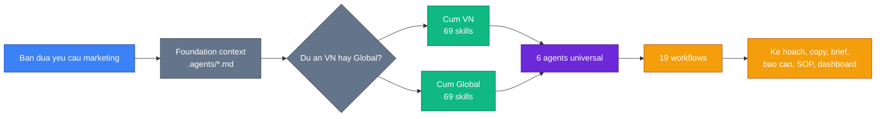
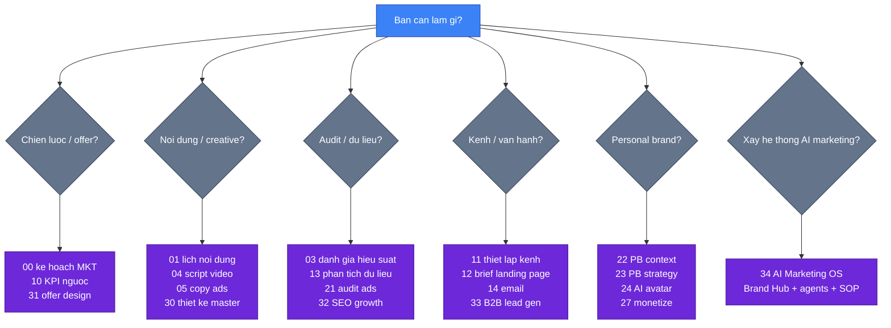
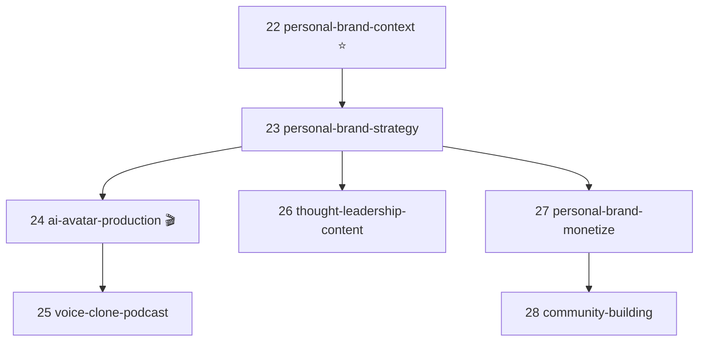
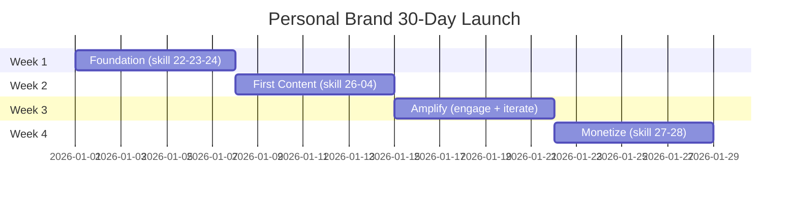
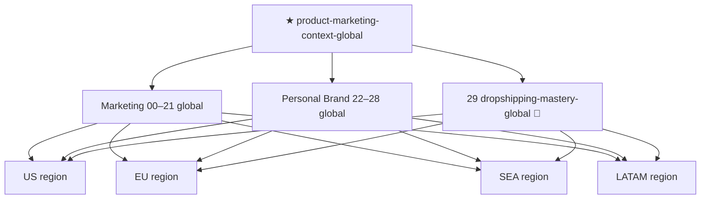
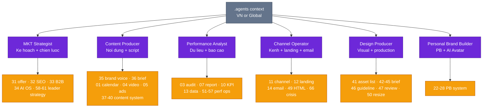

<p align="center">
  <a href="README.md"></a>
  <a href="README.vi.md"></a>
</p>

<p align="center">
  
  
  
  
  
  
  <a href="https://www.opa.business/donate"></a>
</p>

<p align="center">
  <a href="https://www.opa.business/donate">
    
  </a>
  <br/>
  <sub><b>💖 138 skills, 100% mien phi & MIT — neu giup ban tiet kiem thoi gian, hay ung ho tai <a href="https://www.opa.business/donate">opa.business/donate</a></b></sub>
</p>

> **🆕 v3.6.0 (2026-07-30)** — Role SOP Packs Go Global.
> Them 33 skill Global (35-67 `*-global`) — hoan tat parity song ngu cho ca 4 role pack. USD benchmark, kenh toan cau, compliance FTC/GDPR/CCPA. Zero breaking changes.

> **v3.5.0 (2026-07-30)** — Role SOP Deep Integration.
> Them 33 skill VN (35-67) cho 4 vai tro: Content system, Design production, Performance ops, Leader ops. Them kho `knowledge/` nen tang, agent `design-producer`, va 4 workflow vong lap. Zero breaking changes.

> **v3.4.0 (2026-07-08)** — AI Marketing OS Expansion.
> Them 2 skill moi: AI Marketing OS VN + Global — Brand Hub, role-based agents/projects, skill chains, connectors/MCP, second brain, data loops, SOPs. Zero breaking changes.

> **🌍 v2.5.0 (2026-05-08)** — Cum Marketing Toan Cau.
> 30 skills global moi (US/EU/SEA/LATAM), Dropshipping flagship, 5 agents universal. Zero breaking changes.
> [Xem release notes →](docs/release-notes/v2.5.0.md) ·
> [Bat dau nhanh →](docs/getting-started-global.md)

> **🆕 v2.4.0 (2026-05-08)** — Cum Personal Brand + AI Avatar.
> 7 skills moi, 1 agent, 3 workflows. Khong breaking changes.
> [Xem release notes →](docs/release-notes/v2.4.0.md) ·
> [Bat dau nhanh →](docs/getting-started-personal-brand.md)

<h1 align="center">AI Business Skills</h1>

<p align="center">
  <strong>Bien AI thanh tro ly marketing chuyen nghiep — thiet ke cho thi truong Viet Nam.</strong>
  <br/>
  <sub>Framework <b>Over Powers Agency</b> | Claude Code + ChatGPT + Gemini + Copilot + Cursor</sub>
</p>

<p align="center">
  <sub>
    Tuan thu <a href="https://agentskills.io">Agent Skills Spec</a> |
    Claude Code Plugin Marketplace |
    Universal AI agent compat
  </sub>
</p>

---

## Ban do nhanh trong 60 giay

Repo nay co 3 tang de doc cho de: **context** giu thong tin san pham, **skills** lam tung viec marketing, va **agents/workflows** noi nhieu skill thanh mot quy trinh hoan chinh.



### Chon dung skill theo nhu cau



## The Problem

```
Ban:    "Lap ke hoach marketing cho spa di"
AI:     *Tra loi 500 tu chung chung, khong so lieu, khong KPI, khong timeline*

Ban:    "Viet copy quang cao Facebook"
AI:     *1 doan generic, khong phan biet cold/warm/hot audience*

Ban:    "Bao cao thang nay"
AI:     *Liet ke so lieu, khong co nhan dinh, khong de xuat hanh dong*
```

## The Solution

```
Ban:    "Lap ke hoach marketing cho spa"
AI:     *File .md 2000+ tu — 5 phan, bang bieu, KPI 3 kich ban,
         ngan sach phan bo, timeline tuan, risk matrix*

Ban:    "Viet copy quang cao"
AI:     *6 bien the — 2 TOFU + 2 MOFU + 2 BOFU,
         moi bien the co headline + primary text + CTA*

Ban:    "Bao cao thang"
AI:     *Nhan dinh truoc, so lieu minh hoa, nguyen nhan goc re,
         de xuat xu ly 48h + tuan nay, ke hoach thang sau*
```

---

## Foundation Skill — Khong phai hoi lai

Moi skill khac bat dau bang: **doc `.agents/product-marketing-context.md` truoc**.

```
Chay 1 lan dau du an:
> Thiet lap product marketing context cho [san pham]
  → AI tao file .agents/product-marketing-context.md
    chua 12 section (product, audience, persona, 
    doi thu, dinh vi, noi dau, differentiation, ...)

Moi lan sau:
> Viet copy quang cao Facebook
  → AI doc context → viet luon, khong hoi lai
> Lap ke hoach MKT tháng toi
  → AI doc context → lap luon, khong hoi lai
```

Tiet kiem **70% thoi gian** moi cuoc hoi thoai.

---

## Quick Start

### Option 1: Claude Code Plugin (khuyen dung)

```bash
# Trong Claude Code
/plugin marketplace add minhnv0807/ai-business-skills
/plugin install ai-business-skills
```

### Option 2: Clone + Install

```bash
git clone https://github.com/minhnv0807/ai-business-skills.git
cd ai-business-skills
```

<table>
<tr>
<td><b>macOS / Linux</b></td>
<td><b>Windows</b></td>
</tr>
<tr>
<td>

```bash
chmod +x install.sh
./install.sh --global
```

</td>
<td>

```powershell
.\install.ps1 -Global
```

</td>
</tr>
</table>

### Option 3: Voi agent khac (ChatGPT, Gemini, Cursor)

Copy file `.md` lam Custom Instructions hoac context. Moi file la 1 prompt doc lap.

### Use

```
# Lan dau
> Thiet lap product marketing context cho spa Luna

# Cac lan sau — khong can nhac lai thong tin san pham
> Lap ke hoach fullstack marketing thang 5
> Viet script TikTok 30s cho facial moi
> CPMess dang 45K, ROAS 1.8x — danh gia va de xuat toi uu
> Tinh nguoc ngan sach de dat 200 trieu doanh thu/thang
```

---

## 138 Skills (69 VN + 69 Global)

### Cum VN — Marketing core + Personal Brand (36 skills: ★, 00-34)

> 33 skill Role SOP (35-67) nam o [muc rieng ben duoi](#role-sop-packs--33-skill-moi-35-67--v350).

<table>
<tr><th>#</th><th>Skill</th><th>Lam gi</th><th>Category</th></tr>
<tr><td><b>★</b></td><td><a href="skills/vi/product-marketing-context/SKILL.md"><b>Product Marketing Context</b></a></td><td><b>Foundation</b> — doc truoc moi skill, tranh lap lai thong tin</td><td>


</td></tr>
<tr><td><code>00</code></td><td><a href="skills/vi/00-ke-hoach-mkt/SKILL.md"><b>Ke Hoach MKT</b></a></td><td>Ke hoach toan dien 7 phan + SAVE framework + risk matrix</td><td>


</td></tr>
<tr><td><code>01</code></td><td><a href="skills/vi/01-lich-noi-dung/SKILL.md"><b>Lich Noi Dung</b></a></td><td>Lich thang + repurposing matrix 1:9 + AI scoring</td><td>


</td></tr>
<tr><td><code>02</code></td><td><a href="skills/vi/02-brief-chien-dich/SKILL.md"><b>Brief Chien Dich</b></a></td><td>Brief 9 phan + RACI matrix + risk mitigation</td><td>


</td></tr>
<tr><td><code>03</code></td><td><a href="skills/vi/03-danh-gia-hieu-suat/SKILL.md"><b>Danh Gia Hieu Suat</b></a></td><td>Diagnostic tree + 5 Whys + 48h action plan</td><td>


</td></tr>
<tr><td><code>04</code></td><td><a href="skills/vi/04-script-video/SKILL.md"><b>Script Video</b></a></td><td>Script A/B + 5 hook types + viral score + filming guide</td><td>


</td></tr>
<tr><td><code>05</code></td><td><a href="skills/vi/05-copy-quang-cao/SKILL.md"><b>Copy Quang Cao</b></a></td><td>6 variations 3 tang pheu + emotional triggers</td><td>


</td></tr>
<tr><td><code>06</code></td><td><a href="skills/vi/06-brief-ugc-egc/SKILL.md"><b>Brief UGC/EGC</b></a></td><td>Brief creator + legal + payment + batch management</td><td>


</td></tr>
<tr><td><code>07</code></td><td><a href="skills/vi/07-bao-cao-marketing/SKILL.md"><b>Bao Cao Marketing</b></a></td><td>Bao cao thang doc 5 phut — nhan dinh truoc, so lieu sau</td><td>


</td></tr>
<tr><td><code>08</code></td><td><a href="skills/vi/08-nghien-cuu-doi-thu/SKILL.md"><b>Nghien Cuu Doi Thu</b></a></td><td>3 tang doi thu + SWOT + positioning map + gaps</td><td>


</td></tr>
<tr><td><code>09</code></td><td><a href="skills/vi/09-insight-khach-hang/SKILL.md"><b>Insight Khach Hang</b></a></td><td>Persona + customer journey + JTBD + validation</td><td>


</td></tr>
<tr><td><code>10</code></td><td><a href="skills/vi/10-tinh-kpi-nguoc/SKILL.md"><b>Tinh KPI Nguoc</b></a></td><td>Doanh thu → ngan sach + 3 kich ban + sensitivity</td><td>


</td></tr>
<tr><td><code>11</code></td><td><a href="skills/vi/11-thiet-lap-kenh/SKILL.md"><b>Thiet Lap Kenh</b></a></td><td>Setup 7 kenh + checklist 4 phase + 30-day plan</td><td>


</td></tr>
<tr><td><code>12</code></td><td><a href="skills/vi/12-brief-landing-page/SKILL.md"><b>Brief Landing Page</b></a></td><td>Brief 7 section + conversion checklist + A/B plan</td><td>


</td></tr>
<tr><td><code>13</code></td><td><a href="skills/vi/13-phan-tich-du-lieu/SKILL.md"><b>Phan Tich Du Lieu</b></a></td><td>Meta/TikTok/GA4 → insight + trend + anomaly</td><td>


</td></tr>
<tr><td><code>14</code></td><td><a href="skills/vi/14-email-marketing/SKILL.md"><b>Email Marketing</b></a></td><td>Welcome/nurture/re-engage + automation + deliverability</td><td>


</td></tr>
<tr><td><code>15</code></td><td><a href="skills/vi/15-social-listening/SKILL.md"><b>Social Listening</b></a></td><td>Brand monitoring + sentiment + crisis protocol</td><td>


</td></tr>
<tr><td><code>16</code></td><td><a href="skills/vi/16-marketing-psychology/SKILL.md"><b>Marketing Psychology</b></a> <sup>NEW</sup></td><td>7 Cialdini principles + VN cultural adaptation</td><td>


</td></tr>
<tr><td><code>17</code></td><td><a href="skills/vi/17-pricing-strategy/SKILL.md"><b>Pricing Strategy</b></a> <sup>NEW</sup></td><td>Pricing tier + charm/anchor/bundle + break-even</td><td>


</td></tr>
<tr><td><code>18</code></td><td><a href="skills/vi/18-referral-program/SKILL.md"><b>Referral Program</b></a> <sup>NEW</sup></td><td>1-way/2-way/affiliate + VN channels + anti-fraud</td><td>


</td></tr>
<tr><td><code>19</code></td><td><a href="skills/vi/19-ab-test-setup/SKILL.md"><b>A/B Test Setup</b></a></td><td>Sample size + 8 what-to-test + significance analysis</td><td>


</td></tr>
<tr><td><code>20</code></td><td><a href="skills/vi/20-brief-client-intake/SKILL.md"><b>Brief Client Intake</b></a> <sup>v2.3</sup></td><td>Form intake 20 nganh + brief 11 phan cho agency</td><td>


</td></tr>
<tr><td><code>21</code></td><td><a href="skills/vi/21-audit-ads-performance/SKILL.md"><b>Audit Ads Performance</b></a> <sup>v2.3</sup></td><td>84 checkpoint + Health Score (0-100) + Quality Gates</td><td>


</td></tr>
<tr><td><code>22</code></td><td><a href="modules/personal-branding/vi/22-personal-brand-context/SKILL.md"><b>Personal Brand Context</b></a> <sup>v2.4 ⭐</sup></td><td>Foundation skill cho personal brand (3 variants: founder/coach/creator)</td><td>


</td></tr>
<tr><td><code>23</code></td><td><a href="modules/personal-branding/vi/23-personal-brand-strategy/SKILL.md"><b>Personal Brand Strategy</b></a> <sup>v2.4</sup></td><td>Chien luoc 12 thang: niche + positioning + content pillars + authority ladder</td><td>


</td></tr>
<tr><td><code>24</code></td><td><a href="modules/personal-branding/vi/24-ai-avatar-production/SKILL.md"><b>AI Avatar Production</b></a> <sup>v2.4 🎬</sup></td><td>Deep-dive AI Avatar (3 tier tool, 4 workflow, QA Score 100)</td><td>


</td></tr>
<tr><td><code>25</code></td><td><a href="modules/personal-branding/vi/25-voice-clone-podcast/SKILL.md"><b>Voice Clone & Podcast</b></a> <sup>v2.4 🎙️</sup></td><td>Audio AI: voice clone, podcast, audiobook, repurpose 1:10</td><td>


</td></tr>
<tr><td><code>26</code></td><td><a href="modules/personal-branding/vi/26-thought-leadership-content/SKILL.md"><b>Thought Leadership Content</b></a> <sup>v2.4</sup></td><td>Long-form text: 3 cau truc, 6 hook, repurpose 1:5</td><td>


</td></tr>
<tr><td><code>27</code></td><td><a href="modules/personal-branding/vi/27-personal-brand-monetize/SKILL.md"><b>Personal Brand Monetize</b></a> <sup>v2.4</sup></td><td>3 phien ban funnel + pricing psychology + thue VN 2026</td><td>


</td></tr>
<tr><td><code>28</code></td><td><a href="modules/personal-branding/vi/28-community-building/SKILL.md"><b>Community Building</b></a> <sup>v2.4</sup></td><td>Blueprint Zalo/Telegram/Skool + cong dong 3 lop</td><td>


</td></tr>
<tr><td><code>29</code></td><td><a href="skills/vi/29-xuat-khau-b2b/SKILL.md"><b>Xuat Khau B2B</b></a></td><td>Export B2B playbook cho SME Viet</td><td>


</td></tr>
<tr><td><code>30</code></td><td><a href="skills/vi/30-thiet-ke-master/SKILL.md"><b>Thiet Ke Master</b></a></td><td>Router thiet ke 8 loai: logo, key visual, social post, infographic...</td><td>


</td></tr>
<tr><td><code>31</code></td><td><a href="skills/vi/31-offer-design/SKILL.md"><b>Offer Design</b></a> <sup>v3.3 NEW</sup></td><td>Value stack + bonus + guarantee + scarcity + upsell/downsell</td><td>


</td></tr>
<tr><td><code>32</code></td><td><a href="skills/vi/32-seo-growth/SKILL.md"><b>SEO Growth</b></a> <sup>v3.3 NEW</sup></td><td>SEO audit + AI SEO/GEO + schema + pSEO + directory submissions</td><td>


</td></tr>
<tr><td><code>33</code></td><td><a href="skills/vi/33-b2b-lead-gen/SKILL.md"><b>B2B Lead Gen</b></a> <sup>v3.3 NEW</sup></td><td>Prospecting + cold email + lead scoring + sales handoff</td><td>


</td></tr>
<tr><td><code>34</code></td><td><a href="skills/vi/34-ai-marketing-os/SKILL.md"><b>AI Marketing OS</b></a> <sup>v3.4 NEW</sup></td><td>Brand Hub + role-based agents/projects + skill chain + second brain + data loop + SOP</td><td>


</td></tr>
</table>

---

## Cum Personal Brand + AI Avatar (NEW v2.4.0)

7 skill moi cho founder/coach/creator xay dung personal brand voi AI Avatar.

### Cluster Diagram



### Timeline 30 ngay launch



### Ma tran tool 3 tang (rut gon)

| Tier | Chi phi/thang | Tool | Phu hop |
|------|---------------|------|---------|
| Free | $0 | Captions free, HeyGen trial | 1-5 video/thang |
| Pro | $30-100 | HeyGen Creator, ElevenLabs Pro | 10-30 video/thang |
| Enterprise | $200+ | Synthesia Enterprise, custom API | 30+ video/thang |

Xem them: [examples/personal-brand-coach.md](examples/personal-brand-coach.md) ·
[docs/getting-started-personal-brand.md](docs/getting-started-personal-brand.md)

---

### Role SOP packs — 33 skill (35-67) ⭐ v3.5.0, ban Global tu v3.6.0

Bon bo SOP theo vai tro. Moi skill la quy trinh van hanh day du: cac khau, input bat buoc, decision rules, tieu chuan chat luong, timeline — khong phai prompt le.

> **Song ngu day du:** moi skill duoi day co ban Global tuong ung trong `skills/en/` (hau to `-global`) — cung framework va quy trinh, nhung benchmark USD, kenh toan cau (Klaviyo/Shopify/Meta US thay Zalo/Shopee), va compliance FTC/GDPR/CCPA. Rieng seeding duoc viet lai theo chuan Reddit/Discord/Slack thay vi Facebook Group.

**Content system (35-40)** — vong lap content thang:

| # | Skill | Lam gi |
|---|-------|--------|
| 35 | [Brand Voice](skills/vi/35-brand-voice/SKILL.md) | Brand personality, tone, vocabulary, banned words, 5 vi du before/after — nen tang cho moi output content |
| 36 | [Content Brief](skills/vi/36-content-brief/SKILL.md) | Brief tung bai: angle, insight goc, key message, CTA, format |
| 37 | [Caption Social](skills/vi/37-caption-social/SKILL.md) | Caption organic Facebook/Instagram/TikTok (khac 05 la ads copy) |
| 38 | [Seeding Plan](skills/vi/38-seeding-plan/SKILL.md) | Ke hoach seeding group/cong dong: chon group, kich ban, lich, do luong |
| 39 | [Content Audit](skills/vi/39-content-audit/SKILL.md) | Audit dinh ky: winner/loser theo pillar, format, hook |
| 40 | [Next Content Plan](skills/vi/40-next-content-plan/SKILL.md) | Plan ky sau tu data ky truoc — khong doan mo |

**Design production (41-50)** — pipeline T-14 den D+1:

| # | Skill | Lam gi |
|---|-------|--------|
| 41 | [Campaign Asset List](skills/vi/41-campaign-asset-list/SKILL.md) | Danh sach asset: loai, kich thuoc, kenh, deadline, owner, uu tien |
| 42 | [Brief Hinh Anh](skills/vi/42-brief-hinh-anh/SKILL.md) | Brief anh static, banner, thumbnail theo kenh |
| 43 | [Brief Carousel](skills/vi/43-brief-carousel/SKILL.md) | Logic chuoi slide: hook → value → CTA |
| 44 | [Brief Video Editor](skills/vi/44-brief-video-editor/SKILL.md) | Storyboard, footage, text overlay, pacing (khac 04 la script loi thoai) |
| 45 | [Brief Canva](skills/vi/45-brief-canva/SKILL.md) | Direction cho designer dung Canva: template, grid, do/don't |
| 46 | [Brand Guideline](skills/vi/46-brand-guideline/SKILL.md) | Logo, palette, typography, spacing, tone visual — file Brand Hub |
| 47 | [Design Review](skills/vi/47-design-review/SKILL.md) | Cham diem: dung brand, hierarchy, readability, CTA, hop kenh |
| 48 | [Quick Visual Brief](skills/vi/48-quick-visual-brief/SKILL.md) | Brief gap khi campaign dang chay (creative fatigue) |
| 49 | [HTML Email Template](skills/vi/49-html-email-template/SKILL.md) | Email HTML responsive: table-based, inline CSS, dark mode |
| 50 | [Asset Resize](skills/vi/50-asset-resize/SKILL.md) | SOP resize da kich thuoc, safe zone, dat ten file |

**Performance ops (51-57)** — vong lap ads:

| # | Skill | Lam gi |
|---|-------|--------|
| 51 | [Audience Research](skills/vi/51-audience-research/SKILL.md) | Tep target, interest mapping, phan tang cold/warm/hot |
| 52 | [Account Structure](skills/vi/52-account-structure/SKILL.md) | Campaign/adset/ad hierarchy, naming convention, CBO/ABO |
| 53 | [Tracking Setup](skills/vi/53-tracking-setup/SKILL.md) | Pixel/CAPI, GA4, UTM, checklist verify — khong chay ads khi chua xanh |
| 54 | [Media Plan](skills/vi/54-media-plan/SKILL.md) | Tinh nguoc doanh thu → CPL max → budget; split 30/50/15/5 |
| 55 | [Scaling Ads](skills/vi/55-scaling-ads/SKILL.md) | Dieu kien scale, vertical +20-30%, horizontal — khong scale khi CPL xau |
| 56 | [Retargeting Plan](skills/vi/56-retargeting-plan/SKILL.md) | Phan tang warm audience, message theo tang, frequency cap, LAL |
| 57 | [Next Ads Plan](skills/vi/57-next-ads-plan/SKILL.md) | Plan ads ky sau tu report + audit + test log |

**Leader ops (58-67)** — nhip quan ly:

| # | Skill | Lam gi |
|---|-------|--------|
| 58 | [Positioning](skills/vi/58-positioning/SKILL.md) | Promise + Proof + Path, differentiation matrix, tagline direction |
| 59 | [Go-To-Market](skills/vi/59-go-to-market/SKILL.md) | GTM plan: beachhead, message, kenh theo giai doan, go/no-go |
| 60 | [Launch Playbook](skills/vi/60-launch-playbook/SKILL.md) | Timeline T-30 → D+7, checklist tung bo phan, war-room |
| 61 | [Budget Planning](skills/vi/61-budget-planning/SKILL.md) | Phan bo theo kenh/funnel/thang, nguong cat lo, quy du phong |
| 62 | [Marketing Review](skills/vi/62-marketing-review/SKILL.md) | Gate duyet content brief + ads copy, verdict approve/revise |
| 63 | [Campaign Retrospective](skills/vi/63-campaign-retrospective/SKILL.md) | What worked/didn't/why co evidence, bai hoc → playbook |
| 64 | [Team Brief](skills/vi/64-team-brief/SKILL.md) | Giao task: deliverable, deadline theo gio, definition of done + template hop |
| 65 | [Team Performance Review](skills/vi/65-team-performance-review/SKILL.md) | KPI scorecard theo role, development plan 30/90 ngay |
| 66 | [Crisis Playbook](skills/vi/66-crisis-playbook/SKILL.md) | Phan loai L1-L5, quy trinh 4 gio dau, template phan hoi, escalation |
| 67 | [Agency Vendor Brief](skills/vi/67-agency-vendor-brief/SKILL.md) | Scope of work, revision rounds, payment milestone, IP, danh gia vendor |

> **Kho kien thuc nen tang:** [`knowledge/`](knowledge/) — 10 file tu duy + `knowledge/trien-khai/`. Dung lam context upload cho AI project theo vai tro (Leader/Content/Designer/Performance). Kien truc 5 role project: skill [`34-ai-marketing-os`](skills/vi/34-ai-marketing-os/SKILL.md).

---

### Cum Global (36 skills)

<table>
<tr><th>#</th><th>Skill</th><th>Lam gi</th><th>Category</th></tr>
<tr><td><b>★</b></td><td><a href="skills/en/product-marketing-context-global/SKILL.md"><b>Product Marketing Context Global</b></a></td><td><b>Foundation</b> — context theo region + tien te + thue + luat privacy</td><td>


</td></tr>
<tr><td><code>00–21</code></td><td><a href="skills/en/"><b>Marketing 22 skills (global)</b></a></td><td>Mirror VN 00–21 voi suffix <code>-global</code> — plan, lich, brief, audit, copy, KPI, kenh, A/B, intake, audit ads</td><td>

   

</td></tr>
<tr><td><code>22–28</code></td><td><a href="modules/personal-branding/en/"><b>Personal Brand 7 skills (global)</b></a></td><td>Mirror VN 22–28 voi suffix <code>-global</code> — context, strategy, AI Avatar, voice clone, thought leadership, monetize, community</td><td>

   

</td></tr>
<tr><td><code>29</code></td><td><a href="modules/dropshipping/en/29-dropshipping-mastery-global/SKILL.md"><b>Dropshipping Mastery</b></a> <sup>v2.5 🚀</sup></td><td><b>Flagship</b> — Shopify + supplier sourcing + winning products + global ads</td><td>


</td></tr>
<tr><td><code>30</code></td><td><a href="skills/en/30-design-master-global/SKILL.md"><b>Design Master Global</b></a></td><td>Global mirror cho 8 loai thiet ke marketing</td><td>


</td></tr>
<tr><td><code>31-34</code></td><td><a href="skills/en/"><b>Growth + AI Marketing OS Global</b></a> <sup>v3.4 NEW</sup></td><td>Offer Design + SEO/GEO Growth + B2B Lead Gen + AI Marketing OS global mirrors</td><td>

  

</td></tr>
</table>

---

## Cum Global (NEW v2.5.0)

36 skill Global cho marketer, founder, dropshipper, SaaS/growth team hoat dong tren **US / EU / SEA / LATAM** — tien te, thue, luat privacy (GDPR/CCPA/PDPA/LGPD), va tool stack theo region.

### Cluster Diagram



### Tong quan 4 region

| Region | Tien te | Privacy | Kenh chinh | Ghi chu |
|--------|---------|---------|------------|---------|
| **US** | USD | CCPA / luat tung bang | Meta, Google, TikTok, YouTube | Klaviyo + Shopify la stack mac dinh |
| **EU** | EUR / GBP | GDPR | Meta, Google, TikTok, LinkedIn | VAT/OSS, cookie consent bat buoc |
| **SEA** | IDR / THB / SGD / PHP | PDPA (theo nuoc) | TikTok Shop, Shopee, Lazada, Meta | Mobile-first, COD pho bien |
| **LATAM** | BRL / MXN / ARS | LGPD (BR) | Meta, TikTok, MercadoLibre, WhatsApp | Lam phat cao - can hedge FX |

### Dropshipping flagship (skill 29)

Playbook dropshipping end-to-end: chon niche → validate winning product → sourcing supplier (CJ/Spocket/Zendrop) → setup Shopify → chay quang cao Meta/TikTok global → SOP fulfillment → scale len $10K/thang+. Co 4 model scaling theo region.

### Ma tran tool 3 tang (Global)

| Tier | Chi phi/thang | Stack | Phu hop |
|------|---------------|-------|---------|
| Free | $0 | Shopify trial, Meta free, Canva free | Giai doan validate |
| Pro | $200-500 | Shopify Basic, Klaviyo, Meta + TikTok ads | Store $1K-10K/thang |
| Enterprise | $1000+ | Shopify Plus, Klaviyo, Triple Whale, agency creatives | Store $10K+/thang |

Xem them: [examples/personal-brand-coach-global.md](examples/personal-brand-coach-global.md) ·
[examples/dropshipping-store-global.md](examples/dropshipping-store-global.md) ·
[docs/getting-started-global.md](docs/getting-started-global.md) ·
[docs/dropshipping-guide.md](docs/dropshipping-guide.md)

---

## 6 Agents (Universal mode — VN + Global)

> **Cap nhat v2.5:** Tat ca agent chay o **universal mode** — tu dong nhan dien project la VN hay Global va route den skill tuong ung (`00-...` hoac `00-...-global`).
> **v3.5:** them agent `design-producer` cho mang visual & production (skills 41-50).



| Agent | Mode | Skills chinh (VN / Global) |
|-------|------|----------------------------|
| [MKT Strategist](agents/mkt-strategist.md) | Universal <sup>v3.5</sup> | 00, 02, 08, 09, 16, 17, 31-34, 58-61 (+ mirror `-global`) |
| [Content Producer](agents/content-producer.md) | Universal <sup>v3.5</sup> | 01, 04, 05, 06, 35-40, 42-44 (+ mirror `-global`) |
| [Performance Analyst](agents/performance-analyst.md) | Universal <sup>v3.5</sup> | 03, 07, 10, 13, 19, 21, 32, 34, 51-57 (+ mirror `-global`) |
| [Channel Operator](agents/channel-operator.md) | Universal <sup>v3.5</sup> | 11, 12, 14, 15, 18, 34, 49, 66 (+ mirror `-global`) |
| [Design Producer](agents/design-producer.md) <sup>NEW v3.5</sup> | Universal | 12, 30, 41-50 |
| [Personal Brand Builder](agents/personal-brand-builder.md) | Universal <sup>v2.5</sup> | 22, 23, 24, 25, 26, 27, 28 (+ mirror `-global`) |

---

## 19 Workflows (11 VN + 8 Global)

### Workflow VN (11)

#### Client Onboard — Agency (5-7 ngay) <sup>v2.3</sup>
```
20 Brief Intake → 09 Insight → 08 Doi thu → 10 KPI → 00 Ke hoach → 02 Brief → 01 Lich
```

#### Campaign Launch (14-21 ngay)
```
08 Doi thu → 09 Insight → 00 Ke hoach → 02 Brief → 01+04+05 Content → 06 UGC → 11+12 Kenh
```

#### Monthly Cycle (3-5 ngay)
```
13 Data → 03 Danh gia → 07 Bao cao → 10 KPI moi → 01 Lich moi
```

#### Content Production (hang tuan)
```
Review lich → 04 Script → Quay/Dung → 05 Copy ads → Len lich dang
```

#### Content Engine — vong lap content thang <sup>v3.5 NEW</sup>
```
35 Brand voice → 09 Insight → 01 Calendar → 36 Brief tung bai
  → [37 Caption | 04 Script | 05 Ads copy | 38 Seeding | 06 UGC | 14 Email]
  → [42 Brief anh | 43 Carousel | 44 Video editor]
  → 39 Content audit → 07 Bao cao → 40 Next content plan → (quay lai 01)
```

#### Performance Loop — vong lap ads <sup>v3.5 NEW</sup>
```
51 Audience → 10 KPI nguoc → 54 Media plan → 53 Tracking (verify xanh)
  → 52 Account structure → 05 Ads copy → 19 A/B test → 21 Audit
  → 55 Scaling / 56 Retargeting → 07 Bao cao → 57 Next ads plan
```

#### Design Pipeline — T-14 den D+1 <sup>v3.5 NEW</sup>
```
T-14: 41 Asset list → T-7: concept MVP (45/12) → duyet
T-5: asset phuc tap (12 landing, 49 email) → T-3: carousel/banner (43, 42)
T-1: asset nhanh → Launch: 48 Quick visual standby → D+1: 50 Resize winner
```

#### Leader Cadence — nhip quan ly <sup>v3.5 NEW</sup>
```
Quy:      00 Ke hoach → 61 Budget → (58 Positioning / 59 GTM / 60 Launch)
Campaign: 02 Brief → 64 Team brief → 62 Review copy / 47 Review design
Tuan:     07 Bao cao weekly → 13 Decision log
Ket thuc: 63 Retrospective → cap nhat Brand Hub
```

#### Personal Brand Launch (30 ngay) <sup>v2.4</sup>
```
22 Context → 23 Strategy → 24 AI Avatar → 26 Long-form → 27 Monetize → 28 Community
```

#### AI Avatar Batch (5 ngay × 5 gio) <sup>v2.4 NEW</sup>
```
30 video AI Avatar trong 5 ngay, <$2/video — workflow san xuat day chuyen
```

#### Personal Brand Monthly (3-5 ngay) <sup>v2.4 NEW</sup>
```
13 Data → 03 Audit → 07 Report → review pillars → dieu chinh personal brand
```

### Workflow Global (8) <sup>v2.5 NEW</sup>

| Workflow | Thoi gian | Pipeline |
|----------|-----------|----------|
| [client-onboard-global](workflows/en/client-onboard-global.md) | 5-7 ngay | 20 Intake → 09 Insight → 08 Doi thu → 10 KPI → 00 Plan → 02 Brief → 01 Lich (global) |
| [campaign-launch-global](workflows/en/campaign-launch-global.md) | 14-21 ngay | 08 → 09 → 00 → 02 → 01+04+05 Content → 06 UGC → 11+12 Kenh (global) |
| [monthly-cycle-global](workflows/en/monthly-cycle-global.md) | 3-5 ngay | 13 Data → 03 Audit → 07 Report → 10 KPI moi → 01 Lich moi (global) |
| [content-production-global](workflows/en/content-production-global.md) | hang tuan | Review lich → 04 → 05 → schedule (global, 4 region) |
| [dropshipping-launch-global](modules/dropshipping/workflows/en/dropshipping-launch-global.md) <sup>🚀</sup> | 14-30 ngay | Niche → validate product → store → ads → fulfillment → scale |
| [personal-brand-launch-global](modules/personal-branding/workflows/en/personal-brand-launch-global.md) | 30 ngay | 22 Context → 23 Strategy → 24 AI Avatar → 26 Long-form → 27 Monetize → 28 Community (global) |
| [ai-avatar-batch-global](modules/personal-branding/workflows/en/ai-avatar-batch-global.md) | 5 ngay × 5h | 30 video batch trong 5 ngay, da ngon ngu (EN/ES/PT/ID/TH) |
| [personal-brand-monthly-global](modules/personal-branding/workflows/en/personal-brand-monthly-global.md) | 3-5 ngay | 13 Data → 03 Audit → 07 Report → review pillars → dieu chinh (global) |

---

## Benchmark Vietnam 2025-2026

<table>
<tr><th>Chi so</th><th>Kem</th><th>Trung binh</th><th>Tot</th><th>Xuat sac</th></tr>
<tr><td><b>CPMess Meta</b></td><td>>40K</td><td>25-40K</td><td>18-25K</td><td>&lt;18K</td></tr>
<tr><td><b>CPMess TikTok</b></td><td>>45K</td><td>28-45K</td><td>20-28K</td><td>&lt;20K</td></tr>
<tr><td><b>Lead->Booking</b></td><td>&lt;40%</td><td>40-60%</td><td>60-75%</td><td>>75%</td></tr>
<tr><td><b>Booking->Customer</b></td><td>&lt;25%</td><td>25-40%</td><td>40-55%</td><td>>55%</td></tr>
<tr><td><b>ROAS</b></td><td>&lt;2x</td><td>2-4x</td><td>4-7x</td><td>>7x</td></tr>
<tr><td><b>Email Open Rate</b></td><td>&lt;15%</td><td>15-25%</td><td>25-35%</td><td>>35%</td></tr>
</table>

> Full benchmark theo nganh tai [`references/benchmarks-vietnam.md`](references/benchmarks-vietnam.md) — bo sung v3.5.0: frequency, VTR, organic group/IG, nguong canh bao-tat, decision rules theo target, CPO/ROAS theo nganh, benchmark B2B.

---

## Reference — du lieu dung chung

| File | Noi dung |
|------|----------|
| [`benchmarks-vietnam.md`](references/benchmarks-vietnam.md) | Benchmark VN 2025-2026: paid ads, organic, email, pheu, theo nganh, nguong quyet dinh |
| [`benchmarks-global.md`](references/benchmarks-global.md) | Benchmark US/EU/SEA/LATAM |
| [`kpi-formulas.md`](references/kpi-formulas.md) | Cong thuc KPI marketing |
| [`channel-system.md`](references/channel-system.md) | He sinh thai kenh |
| [`content-angles.md`](references/content-angles.md) | Goc noi dung theo tang pheu |
| [`tool-stack.md`](references/tool-stack.md) | Bo cong cu theo nhom |
| [`marketing-templates-library.md`](references/marketing-templates-library.md) ⭐ | Cau truc 28 template van hanh (planning, tracking dashboard, audit, report, campaign, content calendar) — kem bo cot chuan de skill xuat output dong nhat |
| [`ai-tool-orchestration.md`](references/ai-tool-orchestration.md) ⭐ | Phoi hop nhieu AI tool: vai tro tung tool, quy trinh 9 buoc lap ke hoach, setup project theo vai tro, checklist cau hoi khai thac |

---

## Tuong thich

| Platform | Ho tro | Cach dung |
|----------|--------|----------|
| **Claude Code** | Full | `/plugin install` hoac `install.sh --global` |
| **Claude Pro** | Full | Upload vao Project Knowledge |
| **ChatGPT** | Partial | Upload `.md` lam Custom GPT config |
| **Gemini** | Partial | System prompt / context |
| **Copilot** | Partial | `.github/copilot-instructions.md` |
| **Cursor / Windsurf** | Partial | `.cursorrules` |
| **Bat ky AI agent** | Partial | Moi file `.md` la 1 prompt doc lap |

---

## Project Structure

```
ai-business-skills/
│
├── .claude-plugin/
│   └── marketplace.json              # Claude Code plugin spec: 105 skills
│
├── .github/
│   ├── ISSUE_TEMPLATE/                # Bug report + skill request
│   └── PULL_REQUEST_TEMPLATE/         # New skill + skill update
│
├── knowledge/                           # Kho tu duy nen tang (upload vao AI project)
│   ├── 01-10 *.md                       # Brandformance, blueprint, pheu, kenh, KPI, insight, offer, OS
│   └── trien-khai/                      # Kien thuc trien khai theo vai tro
│
├── skills/                              # Dual-edition skill library
│   ├── vi/                              # VN Edition — 69 skills
│   │   ├── product-marketing-context/   # Foundation skill (★)
│   │   ├── 00-21 marketing core/        # Plan, copy, KPI, ads, email, report
│   │   ├── 29-xuat-khau-b2b/            # Regional flagship for Vietnam
│   │   ├── 30-thiet-ke-master/          # Design master router
│   │   ├── 31-34 growth + AI OS/        # Offer, SEO, B2B lead gen, AI Marketing OS
│   │   ├── 35-40 content system/        # Brand voice, brief, caption, seeding, audit, next plan
│   │   ├── 41-50 design production/     # Asset list, brief visual, guideline, review, resize
│   │   ├── 51-57 performance ops/       # Audience, structure, tracking, media plan, scale, retarget
│   │   ├── 58-67 leader ops/            # Positioning, GTM, launch, budget, review, retro, team, crisis
│   │   └── references/                  # Benchmarks, hooks, tools, legal refs
│   │
│   └── en/                              # Global Edition — 36 skills
│       ├── product-marketing-context-global/  # Foundation (4 region variants: US/EU/SEA/LATAM)
│       ├── 00-21 marketing core global/        # Mirror VN 00-21 with -global suffix
│       ├── 30-design-master-global/            # Design master global
│       ├── 31-34 growth + AI OS global/        # Offer, SEO/GEO, B2B, AI Marketing OS
│       └── references/                         # Legal, currency, channel, benchmark refs
│
├── modules/                             # Topic modules outside core marketing
│   ├── personal-branding/               # Personal Brand module
│   │   ├── vi/                          # 7 PB skills VN (22-28)
│   │   ├── en/                          # 7 PB skills Global (22-28-global)
│   │   └── workflows/{vi,en}/           # PB launch, avatar batch, monthly loop
│   │
│   └── dropshipping/                    # Dropshipping module
│       ├── en/29-dropshipping-mastery-global/  # Flagship (12 sections)
│       └── workflows/en/dropshipping-launch-global.md
│
├── workflows/                           # Multi-skill workflow chains
│   ├── vi/                              # Marketing VN workflows
│   │   ├── campaign-launch.md
│   │   ├── client-onboard.md
│   │   ├── content-production.md
│   │   └── monthly-cycle.md
│   │
│   └── en/                              # Marketing Global workflows
│       ├── campaign-launch-global.md
│       ├── client-onboard-global.md
│       ├── content-production-global.md
│       └── monthly-cycle-global.md
│
├── agents/                              # 5 universal agents
│   ├── mkt-strategist.md
│   ├── content-producer.md
│   ├── performance-analyst.md
│   ├── channel-operator.md
│   └── personal-brand-builder.md
│
├── examples/                            # Sample outputs
├── docs/                                # Guides + release notes
├── references/                          # Shared references across skills
├── CONNECTORS.md                        # Tool connector abstraction
├── llms.txt                             # AI-readable repo index
│
├── AGENTS.md                            # Universal agent spec
├── CLAUDE.md                            # Claude-specific config
├── CONTRIBUTING.md                      # How to contribute
├── VERSIONS.md                          # Version tracking
├── validate-skills.sh                   # Bash validator
├── validate-skills.ps1                  # PowerShell validator
├── install.sh                           # macOS/Linux installer
├── install.ps1                          # Windows installer
└── LICENSE                              # MIT
```

---

## Contributing

Doc [`CONTRIBUTING.md`](CONTRIBUTING.md) truoc khi bat dau.

```bash
# 1. Fork repo
# 2. Tao branch
git checkout -b feature/ten-skill-moi

# 3. Chay validator truoc khi commit
./validate-skills.sh

# 4. Conventional Commits
git commit -m "feat(skill): add ten-skill-moi"

# 5. Tao PR voi template
```

---

## Thanks & Credits

- **Inspired by:** [coreyhaines31/marketingskills](https://github.com/coreyhaines31/marketingskills) — foundation skill concept + plugin spec
- **Spec:** [Agent Skills Spec](https://agentskills.io)
- **Framework:** Over Powers Agency — thi truong VN 2025-2026

---

## Star History

<a href="https://star-history.com/#minhnv0807/ai-business-skills&Date">
 <picture>
   <source media="(prefers-color-scheme: dark)" srcset="https://api.star-history.com/svg?repos=minhnv0807/ai-business-skills&type=Date&theme=dark" />
   <source media="(prefers-color-scheme: light)" srcset="https://api.star-history.com/svg?repos=minhnv0807/ai-business-skills&type=Date" />
   
 </picture>
</a>

Neu thay project huu ich, cho 1 sao de theo doi — giup repo xuat hien trong GitHub Trending.

---

## 💖 Ung Ho Du An

Du an nay **100% mien phi va MIT-licensed**. Neu `ai-business-skills` giup ban tiet kiem hang gio cong viec marketing hoac giup doanh nghiep ban phat trien, hay can nhac ung ho:

<p align="center">
  <a href="https://www.opa.business/donate">
    
  </a>
</p>

**Khoan ung ho cua ban se duoc dung de:**
- 🌍 Phat trien region variants moi (APAC v2.6.0, India, MENA o v2.7.0+)
- 🎯 Them skills nganh cu the (B2B export, SaaS, e-commerce vertical)
- 📚 Docs song ngu & video tutorial
- 🛠️ Bao tri & ho tro cong dong

**Cac cach khac de ung ho:**
- ⭐ Star repo nay
- 🐛 Bao loi hoac de xuat tinh nang o [Issues](https://github.com/minhnv0807/ai-business-skills/issues)
- 🤝 Submit PR them skills moi hoac cai tien
- 📣 Chia se voi network cua ban — tag [@OverPowersAgency](https://opa.business)

→ [**opa.business/donate**](https://www.opa.business/donate)

---

## License

MIT — tu do su dung, chinh sua, phan phoi.

---

<p align="center">
  <strong>Framework:</strong> Over Powers Agency
  <br/>
  <strong>Benchmark:</strong> Thi truong Viet Nam 2025-2026
  <br/>
  <strong>Tuong thich:</strong> Claude Code &middot; ChatGPT &middot; Gemini &middot; Copilot &middot; Cursor &middot; bat ky AI nao doc Markdown
</p>

<p align="center">
  <sub>Built with AI, for marketers who use AI.</sub>
</p>
